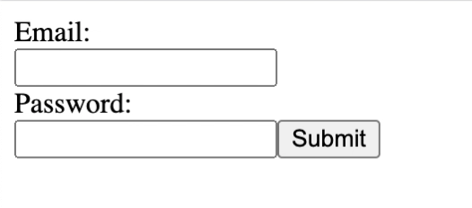

Formik Form Exercise

# Title: Formik Form Exercise

_Created by Maegan Stayrook_

Description:
Maegan had to create a form based off a Formik template. She created a simple one where you are required to use an email login and password.

How to Run:
PLEASE NOTE: This was run through React, so you may have to download files and run npm install into the directory.
 
Load page. Login with email and password; error messages will pop up if you do not use an email or try to skip. This form is merely to show how to use the form; it does not navigate anywhere.

Roadmap:
None at this time for this particular project.

License: MIT License

<!---
Typical things inside a README file:
- Name: The name of the project. This name should be a descriptive, specific name for your project and what it does.  
- Description: A description of the project to let people know what the project is for. A list of features could also be added here as a sub-section. 
- Installation: If needed, you could include steps to help people get started with your project.
- Usage: You can include examples of how to use your project in this section and highlight the expected outcomes. 
- Support: You can tell people where to go for help regarding your project (example: email, Twitter, etc.). 
- Roadmap: This section could include any future fixes or improvements you might be planning for your project. 
- License information: For open source projects, you can describe how they’re licensed.  
--->
 
